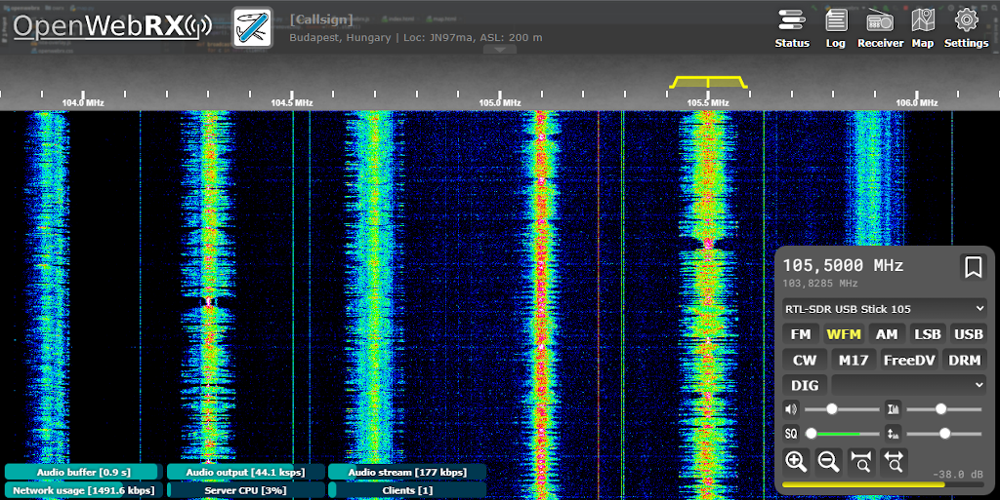

<!--
N.B.: This README was automatically generated by https://github.com/YunoHost/apps/tree/master/tools/README-generator
It shall NOT be edited by hand.
-->

# OpenWebRX for YunoHost

*[Lire ce readme en français.](./README_fr.md)*

> *This package allows you to install OpenWebRX quickly and simply on a YunoHost server.
If you don't have YunoHost, please consult [the guide](https://yunohost.org/#/install) to learn how to install it.*

## Overview

Online multi-user SDR receiver

**Shipped version:** 1.2.0~ynh1

## Screenshots

## Disclaimers / important information

* Some SDR specific dependencies may need manual installation, please see the "Feature report" page available under OpenWebRX's settings.
* Those dependencies are currently not build with this package, you can still follow the wiki, to compile and install them :
    * FreeDV
    * wsjtx 2.4 (2.3 is installed)
    * codecserver_ambe
* The compilation of the DRM demodulator (Digital Radio Mondial) provided by DREAM is offered during installation

## Documentation and resources

* Official app website: <https://www.openwebrx.de>
* Official user documentation: <https://github.com/jketterl/openwebrx/wiki>
* Upstream app code repository: <https://github.com/jketterl/openwebrx>

**More info regarding app packaging:** <https://yunohost.org/packaging_apps>
