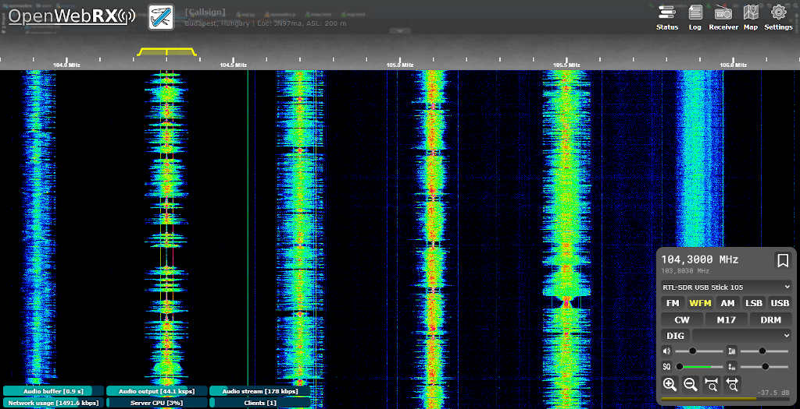

<!--
N.B.: This README was automatically generated by https://github.com/YunoHost/apps/tree/master/tools/README-generator
It shall NOT be edited by hand.
-->

# OpenWebRX pour YunoHost

*[Read this readme in english.](./README.md)*

> *Ce package vous permet d'installer OpenWebRX rapidement et simplement sur un serveur YunoHost.
Si vous n'avez pas YunoHost, regardez [ici](https://yunohost.org/#/install) pour savoir comment l'installer et en profiter.*

## Vue d'ensemble

Récepteur SDR multi-utilisateur

**Version incluse :** 1.2.0~ynh1

## Captures d'écran

## Avertissements / informations importantes

* Certains dépendences spécifiques aux SDRs peuvent nécessiter d'être installés manuellement, le détail peut être obtenu depuis la page "Feature report" située dans les paramètres d'OpenWebRX.
* Ces dépendences ne sont actuellement pas compilés avec ce paquet, mais vous pouvez tout de même les installer en suivant les instructions du wiki d'OpenWebRX :
    * FreeDV
    * wsjtx 2.4 (La version 2.3 est installée)
    * codecserver_ambe
* La compilation du démodulateur DRM (Digital Radio Mondial) fourni par DREAM est proposé lors de l'installation

## Documentations et ressources

* Site officiel de l'app : <https://www.openwebrx.de>
* Documentation officielle utilisateur : <https://github.com/jketterl/openwebrx/wiki>
* Dépôt de code officiel de l'app : <https://github.com/jketterl/openwebrx>

**Plus d'infos sur le packaging d'applications :** <https://yunohost.org/packaging_apps>
